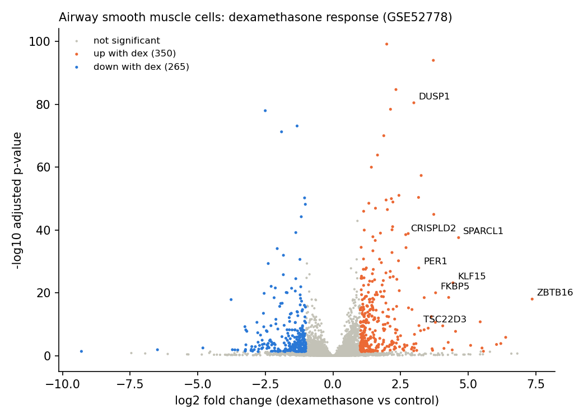
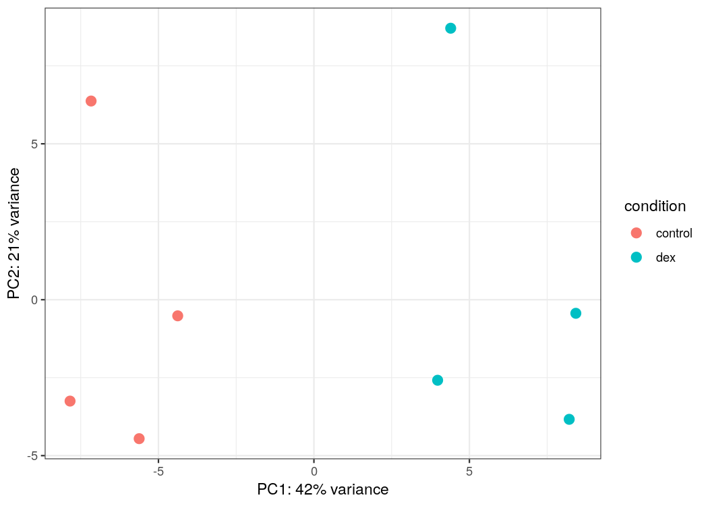
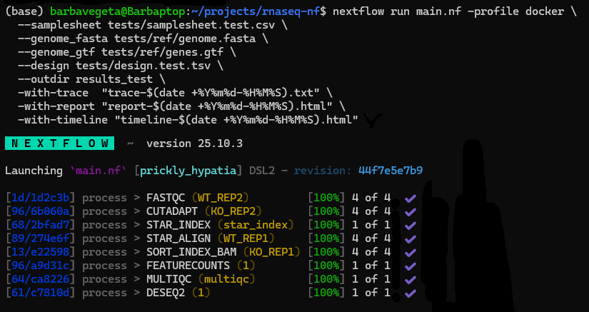

# RNA-seq Nextflow Pipeline with Docker

A samplesheet-driven Nextflow DSL2 pipeline that goes from paired-end FASTQ to differential expression in one command, with every tool in a versioned Docker container:

```
FASTQ → FastQC → Cutadapt ─┬─ STAR → sorted BAM → featureCounts ─┬─→ DESeq2 (any design formula)
                           └─ Salmon → gene-level counts ─────────┘   MultiQC over everything
```

Choose the quantification route with `--aligner star` (genome alignment, the default in the pipeline) or `--aligner salmon` (transcript quantification, ~4 GB RAM, fits a laptop).

## Validated on real data: dexamethasone response in airway smooth muscle

The pipeline was run on the public **airway** dataset (GEO [GSE52778](https://www.ncbi.nlm.nih.gov/geo/query/acc.cgi?acc=GSE52778), Himes et al. 2014, *PLoS One*). It has four human donors' airway smooth muscle cells, each untreated and treated with dexamethasone, giving 8 paired-end libraries (3 million read pairs per sample). DESeq2 used a paired design, `~ cell + condition`, so each donor is compared with itself.



| Check | Result |
|---|---|
| Salmon mapping rate | 93.9–95.3% in all 8 samples |
| Differentially expressed genes (padj < 0.05, \|log2FC\| > 1) | 615 (350 up, 265 down with dexamethasone) |
| Known glucocorticoid-response genes recovered | **8 / 8** |
| Run time, 16 GB laptop (WSL2, Salmon route) | 9.5 min, with FastQC/Cutadapt cached |

| Gene | log2FC | padj |
|---|---|---|
| ZBTB16 | 7.36 | 9.6e-19 |
| SPARCL1 | 4.64 | 2.7e-38 |
| KLF15 | 4.44 | 6.5e-24 |
| FKBP5 | 3.79 | 9.6e-21 |
| TSC22D3 (GILZ) | 3.18 | 2.7e-10 |
| PER1 | 3.17 | 1.2e-28 |
| DUSP1 | 2.99 | 3.4e-81 |
| CRISPLD2 | 2.69 | 3.0e-39 |

Every classic dexamethasone target is strongly induced. CRISPLD2 was the headline gene of the original study. On the PCA, treatment separates the samples on PC1 (42% of variance). PC2 mainly separates donor N080611's two samples from the other donors, which is the donor effect the paired design removes.



The full walkthrough (downloads, memory settings, STAR vs Salmon) is in [`airway/README.md`](airway/README.md), and the result tables are in [`airway/results/`](airway/results/). To reproduce the whole run:

```bash
bash airway/download_reference.sh && bash airway/download_fastq.sh && bash airway/run_airway.sh
```

## Requirements

Nextflow (tested with 26.04) with Java 17 or later, Docker, and Git. Build the images once:

```bash
docker build -t rnaseq-tools:0.1.0  containers/rnaseq-tools    # FastQC, Cutadapt, STAR, samtools, featureCounts, MultiQC
docker build -t rnaseq-r:0.1.0      containers/rnaseq-r        # DESeq2
docker build -t rnaseq-salmon:0.1.0 containers/rnaseq-salmon   # Salmon (only for --aligner salmon)
```

## Quick start (bundled test data)

```bash
nextflow run main.nf -profile docker \
  --samplesheet tests/samplesheet.test.csv \
  --genome_fasta tests/ref/genome.fasta \
  --genome_gtf tests/ref/genes.gtf \
  --design tests/design.test.tsv \
  --outdir results_test \
  -with-report "report-$(date +%Y%m%d-%H%M%S).html" \
  -with-timeline "timeline-$(date +%Y%m%d-%H%M%S).html" \
  -resume
```

The test uses a tiny yeast reference and 50,000 read pairs per sample. It checks the wiring of the STAR route end to end, and it also runs in GitHub Actions on every push. It is not meant for biological interpretation. Timestamped report names avoid Nextflow's refusal to overwrite an existing report.



## Inputs

| Parameter | Description |
|---|---|
| `--samplesheet` | CSV with `sample,fastq_1,fastq_2` |
| `--design` | TSV with `sample`, `condition` and any other covariates (e.g. `cell` for donor) |
| `--genome_fasta`, `--genome_gtf` | reference genome and annotation (STAR route) |
| `--transcript_fasta` | Ensembl cDNA + ncRNA FASTA (Salmon route); gene IDs are read from the headers |
| `--aligner` | `star` or `salmon` |
| `--deseq2_formula` | design formula, default `~ condition`; the tested variable must be `condition` and come last |
| `--deseq2_reference` | reference level of `condition`, so the sign of log2FC is explicit |
| `--star_index_args`, `--sjdb_overhang` | STAR index options, e.g. `--genomeSAsparseD 3` for a lower-memory human index |
| `--count_read_pairs` | featureCounts counts fragments rather than reads for paired-end data (default on) |

## Outputs

In `--outdir`: `counts.tsv` (gene × sample counts from featureCounts or summed Salmon estimates), `deseq2_results.tsv`, `deseq2_ma_plot.png`, `deseq2_pca_plot.png` and `qc/multiqc_report.html`. Use `-with-report`/`-with-timeline` for the Nextflow execution reports.

## Repository structure

```
main.nf, nextflow.config     pipeline and profiles
bin/                         deseq2.R, salmon_gene_counts.py
containers/                  Dockerfiles + conda environments for the three images
tests/                       small test data (CI)
airway/                      real-data run: download scripts, samplesheet, design, preflight, known-gene check, results
img/                         figures used in this README
```

## Notes and limitations

The airway run used the first 3 million read pairs of each library to keep it laptop-sized. `FULL=1 bash airway/download_fastq.sh` fetches the complete files. The STAR route with a human genome needs about 32 GB of RAM to build the index (roughly 16 GB with `--genomeSAsparseD 3`). On a 16 GB laptop, use Salmon or build the index on a larger machine once. Salmon gene counts are transcript estimates summed per gene (as in tximport with `countsFromAbundance = "no"`), which is a standard input for DESeq2.
